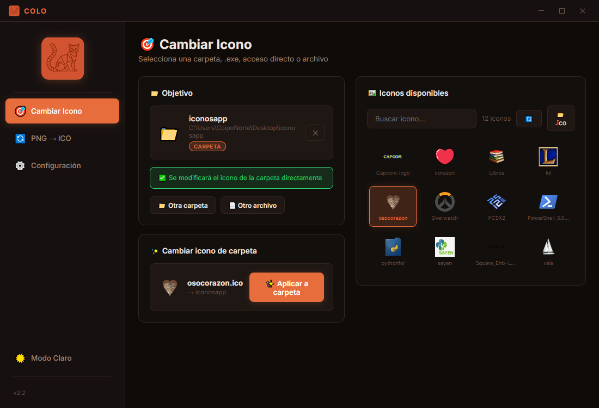

# 🐾 COLO — Icon Changer


**COLO** es una aplicación de escritorio para Windows que permite cambiar iconos de carpetas, accesos directos, archivos ejecutables (.exe) y convertir imágenes a formato .ico. Nombrada en honor al **Colocolo**, un felino silvestre endémico de Chile.

---

## 📸 Vista Previa

<p align="center">
  
</p>

*Interfaz moderna con tema oscuro cálido inspirado en los colores del Colocolo.*

---

## ✨ Características

### 🎯 Cambio de Iconos
- **📁 Carpetas** → Modifica `desktop.ini` directamente
- **🔗 Accesos directos (.lnk)** → Cambia `IconLocation` via PowerShell
- **⚙️ Ejecutables (.exe)** → Edita recursos internos con `rcedit`
- **📄 Otros archivos** → Crea acceso directo personalizado con el icono elegido

### 🔄 Conversor PNG → ICO
- Convierte PNG, JPG, WEBP y BMP a formato `.ico`
- Genera iconos multi-tamaño: 16, 32, 48, 64, 128 y 256px
- Conversión individual o por lotes (batch)
- Resolución automática de conflictos de nombre
- Carpeta de destino configurable

### 🖼️ Explorador de Iconos
- Escanea carpetas en busca de archivos `.ico`
- Vista en grilla con miniaturas
- Búsqueda en tiempo real por nombre
- Selección de `.ico` individual desde cualquier ubicación

### ⚡ Herramientas de Cache
- Refresco de cache via `SHChangeNotify` (API nativa de Windows)
- Notificación específica por carpeta modificada
- Botón para reiniciar Explorer
- Soporte para `ie4uinit` como respaldo

### 🎨 Temas
- **Modo Oscuro** — Paleta cálida con tonos marrón y naranja
- **Modo Claro** — Tonos crema y arena
- Colores inspirados en el pelaje del Colocolo:
  - Naranja rojizo `#E76D3C`
  - Marrón oscuro `#5C2A1E`
  - Marco `#C94A2C`

---

## 🛠️ Stack Tecnológico

| Tecnología | Uso |
|---|---|
| **Electron** | Runtime de escritorio |
| **React 19** | Interfaz de usuario |
| **Vite** | Build tool |
| **rcedit** | Edición de recursos en .exe |
| **nativeImage** | Procesamiento de imágenes (fallback sin sharp) |
| **sharp** | Procesamiento de imágenes (dev, opcional) |
| **PowerShell** | SHChangeNotify, accesos directos, cache |

---

## 🚀 Cómo empezar

### Requisitos
- Node.js 18+
- Windows 10/11
- npm

### Instalación

```bash
# Clonar o descargar el proyecto
cd iconosapp

# Instalar dependencias
npm install

# Ejecutar en modo desarrollo
npm run start

# Compilar .exe portable
npm run dist
```

### Scripts disponibles

| Script | Acción |
|---|---|
| `npm run start` | Inicia Vite + Electron en modo desarrollo |
| `npm run dev` | Solo servidor Vite |
| `npm run build` | Compila React para producción |
| `npm run dist` | Genera `COLO.exe` portable en `/release` |

---

## 🔄 Flujo de trabajo

```
1. Abre COLO
2. Selecciona un objetivo (carpeta, .exe, .lnk o archivo)
3. Explora la grilla de iconos o busca un .ico específico
4. Selecciona el icono deseado
5. Presiona "Aplicar" → COLO cambia el icono 🐾
6. Si no ves el cambio, usa "Refrescar cache" o F5 en el explorador
```

### Para convertir imágenes:

```
1. Ve a la pestaña "PNG → ICO"
2. Selecciona una o más imágenes
3. Elige la carpeta destino
4. Presiona "Convertir todos"
5. Los .ico quedan listos para usar
```

---

## 📂 Estructura del Proyecto

```text
├── assets/
│   ├── colocolo.ico      # Icono de la aplicación
│   ├── colocolo.png      # Logo PNG
│   └── view.png          # Captura de pantalla
├── main.cjs              # Proceso principal de Electron
├── preload.cjs           # Puente IPC (API Bridge)
├── src/
│   ├── components/
│   │   ├── TitleBar.jsx  # Barra de título personalizada
│   │   ├── Sidebar.jsx   # Navegación lateral
│   │   ├── IconGrid.jsx  # Grilla de iconos
│   │   └── Toast.jsx     # Notificaciones
│   ├── views/
│   │   ├── HomeView.jsx      # Vista principal (cambiar iconos)
│   │   ├── ConverterView.jsx # Conversor PNG → ICO
│   │   └── SettingsView.jsx  # Configuración
│   ├── App.jsx           # Componente raíz
│   ├── index.css         # Estilos globales + temas
│   └── main.jsx          # Entry point React
├── index.html            # HTML base
├── package.json          # Dependencias y scripts
├── vite.config.js        # Configuración de Vite
├── electron-builder.yml  # Configuración del build
└── README.md             # Este archivo
```

---

## 🎯 Tipos soportados

| Tipo | Método | Resultado |
|---|---|---|
| 📁 **Carpeta** | `desktop.ini` + `attrib` | Icono cambia en el explorador |
| 🔗 **Acceso directo** | `WScript.Shell.IconLocation` | Icono del .lnk modificado |
| ⚙️ **Ejecutable (.exe)** | `rcedit --set-icon` | Icono incrustado en el .exe |
| 📄 **Otro archivo** | Crea `.lnk` con icono | Acceso directo personalizado |

---

## ⚠️ Notas importantes

- Los archivos `.ico` deben **permanecer en su ubicación** después de asignarlos a carpetas (Windows los referencia por ruta)
- Para cambiar el icono de un `.exe`, este **no debe estar en ejecución**
- Algunos cambios requieren **refrescar el cache** de iconos de Windows (`F5` en el explorador o el botón dentro de COLO)
- La app genera archivos `desktop.ini` ocultos dentro de las carpetas modificadas
- El `.exe` portable pesa ~72 MB (incluye Chromium de Electron)

---

## 🐾 Sobre el nombre

El **Colocolo** (*Leopardus colocola*) es un pequeño felino silvestre que habita en Chile y otras regiones de Sudamérica. Es un animal escurridizo, adaptable y elegante — como esta app que trabaja silenciosamente para personalizar tu escritorio.

---

## 👤 Autor

Desarrollado con ❤️ en Chile por **CoipoNorte**.

> "Un poquito del sure en el norte de Chile"

---

## 📄 Licencia

Proyecto de uso personal. Úsalo bajo tu responsabilidad.
